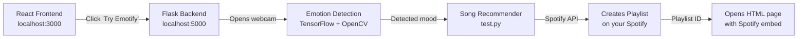

# 🎵 Emotify — Complete Setup & Run Guide

## What is Emotify?

Emotify is a **Music Recommendation System** that uses your webcam to detect your facial emotion (Happy, Sad, Angry, etc.), then creates a Spotify playlist matching your mood.

It has **3 parts** that work together:

| Part | What it does | Tech | Port |
|------|-------------|------|------|
| **Frontend** | React website with "Try Emotify" button | React + Bootstrap | `localhost:3000` |
| **Emotion Detection** | Opens webcam, detects face, predicts emotion | Flask + TensorFlow + OpenCV | `localhost:5000` |
| **Song Recommender** | Creates a Spotify playlist based on detected mood | Spotipy (Spotify API) | — (called by emotion detection) |

## What I've Already Done ✅

1. ✅ Created a **virtual environment** (`venv/`) inside the project on E: drive
2. ✅ Installed **all Python packages** (TensorFlow, OpenCV, Flask, Spotipy, etc.)
3. ✅ Installed **all frontend npm packages**
4. ✅ **Fixed all hardcoded paths** — the original code had paths like `D:\PragyaComputer\Emotify\...` which pointed to the original developer's machine. All 4 Python files now use dynamic path resolution
5. ✅ Added **Flask-CORS** support so the React frontend can talk to the Python backend
6. ✅ Verified **model loads correctly** (48×48 grayscale → 7 emotions)

---

## How to Run

### Step 1: Start the Emotion Detection Backend (Flask)

Open a terminal and run:
```powershell
cd "e:\1_B.E. in IT\DE-Project\de-project\Emotify-Arithemania"
.\venv\Scripts\activate
python emotionDetection\main.py
```

This starts Flask on **http://127.0.0.1:5000**

### Step 2: Start the React Frontend

Open a **second terminal** and run:
```powershell
cd "e:\1_B.E. in IT\DE-Project\de-project\Emotify-Arithemania\frontend"
npm start
```

This starts React on **http://localhost:3000**

### Step 3: Use the App

1. Open **http://localhost:3000** in your browser
2. Click **"Try Emotify"** — this triggers the Flask backend
3. Your **webcam opens** and detects your emotion for ~50 frames
4. Press **Q** to stop early, or wait for it to finish
5. The detected mood maps to a Spotify playlist which opens in your browser

---

## ⚠️ Spotify API Setup (IMPORTANT)

The Spotify integration **requires a Spotify Developer account**. The credentials in the code belong to the original developer and **may no longer work**.

### To set up your own Spotify API credentials:

1. Go to [Spotify Developer Dashboard](https://developer.spotify.com/dashboard)
2. Log in with your Spotify account (or create one)
3. Click **"Create App"**
4. Set the **Redirect URI** to: `http://localhost:8000`
5. Note your **Client ID** and **Client Secret**
6. Update these values in two files:
   - [helpers.py](file:///e:/1_B.E.%20in%20IT/DE-Project/de-project/Emotify-Arithemania/songRecommender/helpers.py) — lines 5-6
   - [test.py](file:///e:/1_B.E.%20in%20IT/DE-Project/de-project/Emotify-Arithemania/songRecommender/test.py) — lines 16-17

> [!WARNING]
> Without valid Spotify credentials, the emotion detection will work but the playlist creation will fail. You **must** set up your own Spotify Developer app.

---

## Flow Diagram



---

## Files Changed

| File | Change |
|------|--------|
| [main.py](file:///e:/1_B.E.%20in%20IT/DE-Project/de-project/Emotify-Arithemania/emotionDetection/main.py) | Fixed hardcoded paths → dynamic resolution, updated keras imports, added CORS, fixed operator precedence bug |
| [test.py](file:///e:/1_B.E.%20in%20IT/DE-Project/de-project/Emotify-Arithemania/songRecommender/test.py) | Fixed hardcoded paths → dynamic resolution |
| [test2.py](file:///e:/1_B.E.%20in%20IT/DE-Project/de-project/Emotify-Arithemania/songRecommender/test2.py) | Fixed hardcoded paths → dynamic resolution, fixed `os.system` for Windows |
| [helpers.py](file:///e:/1_B.E.%20in%20IT/DE-Project/de-project/Emotify-Arithemania/songRecommender/helpers.py) | Added environment variable support for Spotify credentials |
| [requirements.txt](file:///e:/1_B.E.%20in%20IT/DE-Project/de-project/Emotify-Arithemania/requirements.txt) | **New** — lists all Python dependencies |
